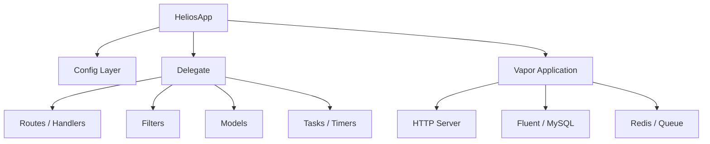

# Helios ☀️

[](https://github.com/enums/Helios/actions/workflows/ci.yml)
[](https://swift.org)
[](#)
[](./LICENSE)

Helios 是一个基于 Vapor 的轻量后端框架骨架，目标是把「可跑的服务」快速收敛成「可长期演进的系统」。

它面向这类场景：

- 中小型网站 / API 服务
- 长期运行在 Linux 的 Swift 服务
- 希望保留清晰扩展点（Handler / Filter / Task / Timer / Model）

---

## ✨ 现在有什么

- 🧭 **统一应用入口**：`HeliosApp`
- 🧩 **业务接入点**：`HeliosAppDelegate`
- 🌐 **路由处理抽象**：`HeliosHandler`
- 🛡️ **过滤器抽象**：`HeliosFilter`
- ⏱️ **后台任务抽象**：`HeliosTask` / `HeliosTimer`
- 🗃️ **模型抽象**：`HeliosModel`
- ⚙️ **配置加载链路**：`ConfigSource` / `HeliosConfigLoader` / Runtime Config
- 🧪 **测试基线**：Smoke / Integration / RuntimeContract 等测试
- 🚦 **CI 基线**：SwiftLint + macOS / Linux build & test

---

## 🏗️ 系统结构（概览）



> 设计原则：先保证主路径稳定，再把扩展边界做清晰。

---

## 📁 目录结构

```text
Sources/Helios/
├── App/
│   ├── HeliosApp.swift
│   ├── HeliosAppDelegate.swift
│   ├── HeliosRouteDescriptor.swift
│   └── ...
├── Base/
│   ├── HeliosAppConfig.swift
│   ├── HeliosConfigLoader.swift
│   ├── RuntimeConfigLoader.swift
│   └── ...
├── Models/
├── Plugins/
└── Views/

Tests/HeliosTests/
├── SmokeTests.swift
├── IntegrationTests.swift
├── RuntimeContractTests.swift
└── ...
```

---

## 🚀 快速开始

### 1) 依赖

```swift
.package(url: "https://github.com/enums/Helios.git", branch: "main")
```

### 2) 最小 Delegate

```swift
import Vapor
import Helios

final class AppDelegate: HeliosAppDelegate {
    func routes(app: HeliosApp) -> [String : [HTTPMethod : HeliosHandlerBuilder]] {
        [
            "/ping": [
                .GET: PingHandler.builder,
            ]
        ]
    }
}

struct PingHandler: HeliosHandler {
    init() {}

    func handle(req: Request) async throws -> AsyncResponseEncodable {
        Response(status: .ok, body: .init(string: "pong"))
    }
}
```

### 3) 配置文件

当前默认读取：

```text
<workspace>/Config/config.json
```

可参考：

- `Config/base.example.json`
- `Config/production.example.json`

### 4) 启动

```swift
let helios = try HeliosApp.create(workspace: "/path/to/workspace/", delegate: AppDelegate())
try helios.run()
```

---

## ✅ CI 基线

当前默认 CI 组合：

- **Lint**：SwiftLint（Ubuntu）
- **Build & Test**：
  - Ubuntu 22.04 + Swift 5.9
  - macOS 15 + Xcode 默认 Swift

对应 workflow：`.github/workflows/ci.yml`

---

## 🧪 测试

```bash
swift test
```

当前测试以「零外部依赖可跑」为原则，优先保障：

- 主流程 smoke
- 关键集成基线
- runtime contract 相关行为

详见：`Tests/README.md`

---

## 🗺️ 路线

当前主线（按优先级）大致为：

- P0：测试基线持续补齐与稳定
- P1：配置系统与启动编排继续收口
- P2：扩展点边界（Handler / Task / Timer）进一步明确
- P3：文档、版本治理与长期维护体验提升

---

## 📌 当前定位

Helios 现在不是“功能堆满”的大框架，而是一个**可控、可演进**的 Swift 后端骨架。

如果你想要的是：

- 结构清楚
- 扩展点明确
- 可以跟着项目一起长大的基础设施

它就是一个合适的起点。
